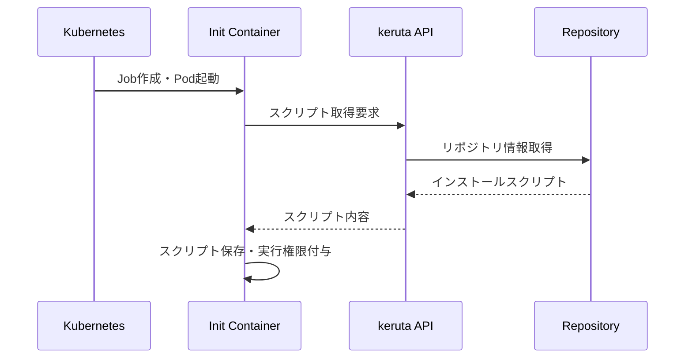
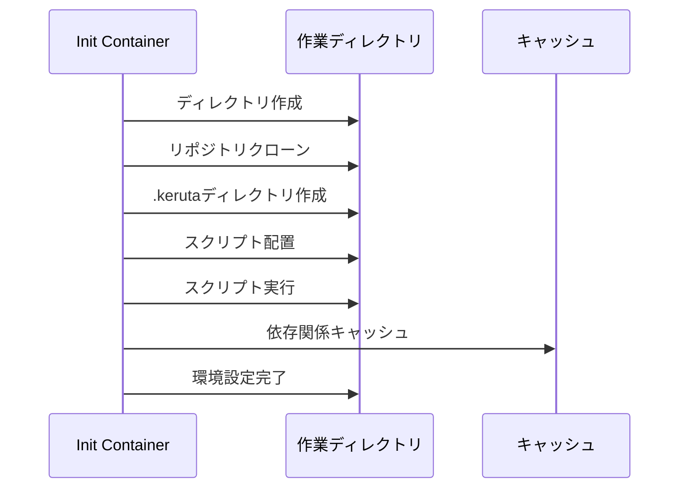

# Job実行前インストールスクリプト仕様書

> **概要**: kerutaシステムにおけるjob実行前のインストールスクリプトの詳細仕様、実行フロー、セキュリティ要件、エラーハンドリングなどをまとめた包括的なドキュメントです。

## 目次
- [概要](#概要)
- [実行フロー](#実行フロー)
- [スクリプト仕様](#スクリプト仕様)
- [環境変数](#環境変数)
- [セキュリティ要件](#セキュリティ要件)
- [エラーハンドリング](#エラーハンドリング)
- [パフォーマンス要件](#パフォーマンス要件)
- [ログ・監視](#ログ監視)
- [サンプル実装](#サンプル実装)
- [トラブルシューティング](#トラブルシューティング)
- [関連リンク](#関連リンク)

## 概要

Job実行前インストールスクリプトは、Kubernetes Jobのメインコンテナが起動する前に、init container内で実行されるスクリプトです。このスクリプトは、タスク実行に必要な環境の準備、依存関係のインストール、設定ファイルの配置などを担当します。

### 主な目的
- **環境準備**: タスク実行に必要な依存関係のインストール
- **設定管理**: 環境変数や設定ファイルの配置
- **セキュリティ**: 最小権限での実行環境構築
- **効率化**: 再利用可能な環境構築の自動化

## 実行フロー

### 1. スクリプト取得フェーズ


### 2. スクリプト実行フェーズ


## スクリプト仕様

### 基本仕様
- **言語**: POSIX準拠シェルスクリプト（`#!/bin/sh`）
- **文字エンコーディング**: UTF-8
- **改行コード**: LF（Unix形式）
- **実行権限**: 755（所有者読み書き実行、グループ・他者読み実行）

### スクリプト構造
```sh
#!/bin/sh
# keruta インストールスクリプト
# 作成日: 2024-01-01
# バージョン: 1.0.0

set -euo pipefail  # 厳格モード

# ログ関数定義
log_info() {
    echo "[INFO] $(date '+%Y-%m-%d %H:%M:%S') - $1"
}

log_error() {
    echo "[ERROR] $(date '+%Y-%m-%d %H:%M:%S') - $1" >&2
}

# メイン処理
main() {
    log_info "インストールスクリプト開始"
    
    # 1. 環境チェック
    check_environment
    
    # 2. 依存関係インストール
    install_dependencies
    
    # 3. 設定ファイル配置
    setup_configuration
    
    # 4. 権限設定
    setup_permissions
    
    log_info "インストールスクリプト完了"
}

# 環境チェック
check_environment() {
    log_info "環境チェック開始"
    
    # 必要なコマンドの存在確認
    for cmd in git curl wget; do
        if ! command -v "$cmd" >/dev/null 2>&1; then
            log_error "必要なコマンドが見つかりません: $cmd"
            exit 1
        fi
    done
    
    # 作業ディレクトリの確認
    if [ ! -d "/work" ]; then
        log_error "作業ディレクトリ /work が見つかりません"
        exit 1
    fi
    
    log_info "環境チェック完了"
}

# 依存関係インストール
install_dependencies() {
    log_info "依存関係インストール開始"
    
    cd /work
    
    # Node.js プロジェクト
    if [ -f "package.json" ]; then
        log_info "Node.js依存関係をインストール中..."
        npm ci --only=production --no-audit --no-fund
    fi
    
    # Python プロジェクト
    if [ -f "requirements.txt" ]; then
        log_info "Python依存関係をインストール中..."
        pip install --no-cache-dir -r requirements.txt
    fi
    
    # Java Maven プロジェクト
    if [ -f "pom.xml" ]; then
        log_info "Maven依存関係をインストール中..."
        mvn dependency:resolve -q
    fi
    
    # Java Gradle プロジェクト
    if [ -f "build.gradle" ] || [ -f "build.gradle.kts" ]; then
        log_info "Gradle依存関係をインストール中..."
        ./gradlew dependencies --no-daemon -q
    fi
    
    log_info "依存関係インストール完了"
}

# 設定ファイル配置
setup_configuration() {
    log_info "設定ファイル配置開始"
    
    mkdir -p ./.keruta
    
    # 環境変数から設定ファイル生成
    if [ -n "${KERUTA_CONFIG:-}" ]; then
        echo "$KERUTA_CONFIG" > ./.keruta/config.json
        log_info "設定ファイルを配置しました"
    fi
    
    # APIから追加設定を取得
    if [ -n "${KERUTA_REPOSITORY_ID:-}" ] && [ -n "${KERUTA_API_ENDPOINT:-}" ]; then
        log_info "APIから追加設定を取得中..."
        if curl -sfL -o ./.keruta/additional-config.json \
            "${KERUTA_API_ENDPOINT}/api/v1/repositories/${KERUTA_REPOSITORY_ID}/config"; then
            log_info "追加設定を取得しました"
        fi
    fi
    
    log_info "設定ファイル配置完了"
}

# 権限設定
setup_permissions() {
    log_info "権限設定開始"
    
    # .kerutaディレクトリの権限設定
    chmod 755 ./.keruta
    find ./.keruta -type f -exec chmod 644 {} \;
    find ./.keruta -type f -name "*.sh" -exec chmod +x {} \;
    
    # 実行可能ファイルの権限設定
    if [ -f "gradlew" ]; then
        chmod +x gradlew
    fi
    
    log_info "権限設定完了"
}

# エラーハンドリング
trap 'log_error "スクリプト実行中にエラーが発生しました: $?"; exit 1' ERR

# メイン実行
main "$@"
```

### プロジェクトタイプ別テンプレート

#### Node.js テンプレート
```sh
#!/bin/sh
set -euo pipefail

log_info() {
    echo "[INFO] $(date '+%Y-%m-%d %H:%M:%S') - $1"
}

log_info "Node.jsプロジェクトのセットアップ開始"

cd /work

# npmキャッシュクリア
npm cache clean --force

# 依存関係インストール
if [ -f "package.json" ]; then
    log_info "npm依存関係をインストール中..."
    npm ci --only=production --no-audit --no-fund --no-optional
    
    # ビルドスクリプトが存在する場合
    if npm run --silent build 2>/dev/null; then
        log_info "ビルドスクリプトを実行中..."
        npm run build
    fi
fi

# yarn.lockが存在する場合
if [ -f "yarn.lock" ]; then
    log_info "yarn依存関係をインストール中..."
    yarn install --frozen-lockfile --production
fi

log_info "Node.jsプロジェクトのセットアップ完了"
```

#### Python テンプレート
```sh
#!/bin/sh
set -euo pipefail

log_info() {
    echo "[INFO] $(date '+%Y-%m-%d %H:%M:%S') - $1"
}

log_info "Pythonプロジェクトのセットアップ開始"

cd /work

# 仮想環境作成（オプション）
if [ "${KERUTA_CREATE_VENV:-false}" = "true" ]; then
    log_info "仮想環境を作成中..."
    python -m venv .venv
    . .venv/bin/activate
fi

# pip依存関係インストール
if [ -f "requirements.txt" ]; then
    log_info "pip依存関係をインストール中..."
    pip install --no-cache-dir -r requirements.txt
fi

# setup.pyが存在する場合
if [ -f "setup.py" ]; then
    log_info "setup.pyからインストール中..."
    pip install --no-cache-dir -e .
fi

# pyproject.tomlが存在する場合
if [ -f "pyproject.toml" ]; then
    log_info "pyproject.tomlからインストール中..."
    pip install --no-cache-dir .
fi

# poetry.lockが存在する場合
if [ -f "poetry.lock" ]; then
    log_info "Poetry依存関係をインストール中..."
    poetry install --no-dev
fi

log_info "Pythonプロジェクトのセットアップ完了"
```

#### Java Maven テンプレート
```sh
#!/bin/sh
set -euo pipefail

log_info() {
    echo "[INFO] $(date '+%Y-%m-%d %H:%M:%S') - $1"
}

log_info "Java Mavenプロジェクトのセットアップ開始"

cd /work

# Maven設定
export MAVEN_OPTS="-Xmx512m -XX:MaxPermSize=128m"

# 依存関係解決
if [ -f "pom.xml" ]; then
    log_info "Maven依存関係を解決中..."
    mvn dependency:resolve -q
    
    # コンパイル
    log_info "Mavenコンパイル中..."
    mvn compile -q
    
    # テスト（オプション）
    if [ "${KERUTA_RUN_TESTS:-false}" = "true" ]; then
        log_info "Mavenテスト実行中..."
        mvn test -q
    fi
    
    # パッケージング
    log_info "Mavenパッケージング中..."
    mvn package -q -DskipTests
fi

log_info "Java Mavenプロジェクトのセットアップ完了"
```

## 環境変数

### 必須環境変数
| 変数名 | 説明 | 例 | 用途 |
|--------|------|-----|------|
| `KERUTA_TASK_ID` | タスクの一意識別子 | `123e4567-e89b-12d3-a456-426614174000` | タスク識別 |
| `KERUTA_REPOSITORY_ID` | リポジトリID | `repo-123` | スクリプト取得 |
| `KERUTA_API_ENDPOINT` | keruta APIのエンドポイント | `http://keruta-api.keruta.svc.cluster.local` | API通信 |

### オプション環境変数
| 変数名 | 説明 | デフォルト値 | 用途 |
|--------|------|-------------|------|
| `KERUTA_CONFIG` | JSON形式の設定データ | - | 設定ファイル生成 |
| `KERUTA_CREATE_VENV` | Python仮想環境作成 | `false` | Python環境設定 |
| `KERUTA_RUN_TESTS` | テスト実行フラグ | `false` | テスト実行制御 |
| `KERUTA_CACHE_DIR` | キャッシュディレクトリ | `/tmp/keruta-cache` | キャッシュ管理 |
| `KERUTA_TIMEOUT` | スクリプト実行タイムアウト（秒） | `1800` | タイムアウト制御 |
| `KERUTA_LOG_LEVEL` | ログレベル | `INFO` | ログ出力制御 |

### セキュリティ関連環境変数
| 変数名 | 説明 | 用途 |
|--------|------|------|
| `KERUTA_API_TOKEN` | API認証トークン | API認証 |
| `KERUTA_GIT_TOKEN` | Gitアクセストークン | プライベートリポジトリアクセス |
| `KERUTA_REGISTRY_TOKEN` | コンテナレジストリトークン | プライベートイメージ取得 |

## セキュリティ要件

### 実行環境セキュリティ
- **非特権実行**: スクリプトは非rootユーザーで実行
- **最小権限**: 必要最小限の権限のみ付与
- **ネットワーク制限**: 必要なエンドポイントのみアクセス許可
- **ファイルシステム制限**: 読み取り専用マウントの活用

### スクリプトセキュリティ
```sh
# セキュアなスクリプト例
#!/bin/sh
set -euo pipefail  # 厳格モード

# 危険なコマンドの実行制限
forbidden_commands="rm -rf / rm -rf /* sudo su -"
for cmd in $forbidden_commands; do
    if echo "$*" | grep -q "$cmd"; then
        echo "ERROR: 危険なコマンドの実行は禁止されています: $cmd"
        exit 1
    fi
done

# 入力値のサニタイゼーション
sanitize_input() {
    echo "$1" | sed 's/[^a-zA-Z0-9._-]//g'
}

# パスの検証
validate_path() {
    local path="$1"
    if [[ "$path" =~ \.\. ]] || [[ "$path" =~ ^/ ]]; then
        echo "ERROR: 不正なパスです: $path"
        exit 1
    fi
}
```

### 認証・認可
- **API認証**: JWTトークンによる認証
- **リポジトリアクセス**: 適切な権限チェック
- **シークレット管理**: Kubernetes Secretの活用
- **監査ログ**: すべての操作のログ記録

## エラーハンドリング

### エラー分類
| エラータイプ | 説明 | 対応方法 |
|-------------|------|----------|
| **環境エラー** | 必要なコマンドやファイルが存在しない | スクリプト終了、エラーログ出力 |
| **ネットワークエラー** | API通信やダウンロード失敗 | リトライ、タイムアウト設定 |
| **権限エラー** | ファイルアクセス権限不足 | 権限設定、管理者通知 |
| **依存関係エラー** | パッケージインストール失敗 | 代替手段、手動対応 |
| **タイムアウトエラー** | 処理時間超過 | タイムアウト設定、処理分割 |

### エラーハンドリング実装例
```sh
#!/bin/sh
set -euo pipefail

# エラーハンドリング関数
handle_error() {
    local exit_code=$?
    local line_number=$1
    local command=$2
    
    echo "[ERROR] スクリプト実行エラー:"
    echo "  終了コード: $exit_code"
    echo "  行番号: $line_number"
    echo "  コマンド: $command"
    
    # エラー情報をAPIに送信
    if [ -n "${KERUTA_API_ENDPOINT:-}" ] && [ -n "${KERUTA_TASK_ID:-}" ]; then
        curl -sfL -X POST \
            -H "Content-Type: application/json" \
            -d "{\"error\": \"$command failed with exit code $exit_code\"}" \
            "${KERUTA_API_ENDPOINT}/api/v1/tasks/${KERUTA_TASK_ID}/error" || true
    fi
    
    exit $exit_code
}

# エラートラップ設定
trap 'handle_error ${LINENO} "$BASH_COMMAND"' ERR

# タイムアウト設定
timeout_handler() {
    echo "[ERROR] スクリプト実行がタイムアウトしました"
    exit 124
}

# タイムアウト設定（デフォルト30分）
timeout "${KERUTA_TIMEOUT:-1800}" bash -c '
    # メイン処理
    echo "メイン処理開始..."
    # ... 実際の処理 ...
    echo "メイン処理完了..."
' || timeout_handler
```

## パフォーマンス要件

### 実行時間制限
- **標準実行時間**: 最大30分（1800秒）
- **短時間タスク**: 最大5分（300秒）
- **長時間タスク**: 最大2時間（7200秒）

### リソース制限
```yaml
# Kubernetesリソース制限例
resources:
  requests:
    memory: "256Mi"
    cpu: "100m"
  limits:
    memory: "1Gi"
    cpu: "500m"
```

### 最適化手法
- **キャッシュ活用**: 依存関係のキャッシュ
- **並列処理**: 可能な処理の並列実行
- **差分更新**: 変更された部分のみ処理
- **レイヤー最適化**: Dockerイメージの最適化

## ログ・監視

### ログ出力仕様
```sh
# ログ出力関数
log_info() {
    echo "[INFO] $(date '+%Y-%m-%d %H:%M:%S') - $1" | tee -a /work/.keruta/install.log
}

log_error() {
    echo "[ERROR] $(date '+%Y-%m-%d %H:%M:%S') - $1" | tee -a /work/.keruta/install.log >&2
}

log_debug() {
    if [ "${KERUTA_LOG_LEVEL:-INFO}" = "DEBUG" ]; then
        echo "[DEBUG] $(date '+%Y-%m-%d %H:%M:%S') - $1" | tee -a /work/.keruta/install.log
    fi
}
```

### 監視メトリクス
- **実行時間**: スクリプト実行時間の計測
- **成功率**: スクリプト実行成功率
- **エラー率**: エラー発生率とエラータイプ
- **リソース使用量**: CPU・メモリ使用量
- **ネットワーク使用量**: ダウンロード量・通信時間

### アラート設定
- **実行時間超過**: 30分を超えた場合
- **エラー率上昇**: 10%を超えた場合
- **リソース不足**: メモリ使用量80%超過
- **ネットワークエラー**: 連続3回失敗

## サンプル実装

### 完全なサンプルスクリプト
```sh
#!/bin/sh
# keruta インストールスクリプト v1.0.0
# 作成日: 2024-01-01
# 説明: 汎用的なプロジェクトセットアップスクリプト

set -euo pipefail

# 定数定義
readonly SCRIPT_VERSION="1.0.0"
readonly CACHE_DIR="${KERUTA_CACHE_DIR:-/tmp/keruta-cache}"
readonly WORK_DIR="/work"
readonly KERUTA_DIR="$WORK_DIR/.keruta"
readonly LOG_FILE="$KERUTA_DIR/install.log"

# ログ関数
log_info() {
    echo "[INFO] $(date '+%Y-%m-%d %H:%M:%S') - $1" | tee -a "$LOG_FILE"
}

log_error() {
    echo "[ERROR] $(date '+%Y-%m-%d %H:%M:%S') - $1" | tee -a "$LOG_FILE" >&2
}

log_debug() {
    if [ "${KERUTA_LOG_LEVEL:-INFO}" = "DEBUG" ]; then
        echo "[DEBUG] $(date '+%Y-%m-%d %H:%M:%S') - $1" | tee -a "$LOG_FILE"
    fi
}

# 初期化
init() {
    log_info "keruta インストールスクリプト開始 (v$SCRIPT_VERSION)"
    
    # ディレクトリ作成
    mkdir -p "$KERUTA_DIR"
    mkdir -p "$CACHE_DIR"
    
    # ログファイル初期化
    echo "=== keruta インストールログ ===" > "$LOG_FILE"
    echo "開始時刻: $(date)" >> "$LOG_FILE"
    echo "スクリプトバージョン: $SCRIPT_VERSION" >> "$LOG_FILE"
    echo "作業ディレクトリ: $WORK_DIR" >> "$LOG_FILE"
    
    # 環境変数ログ
    log_debug "環境変数:"
    log_debug "  KERUTA_TASK_ID: ${KERUTA_TASK_ID:-未設定}"
    log_debug "  KERUTA_REPOSITORY_ID: ${KERUTA_REPOSITORY_ID:-未設定}"
    log_debug "  KERUTA_API_ENDPOINT: ${KERUTA_API_ENDPOINT:-未設定}"
}

# 環境チェック
check_environment() {
    log_info "環境チェック開始"
    
    # 必要なコマンドの確認
    local required_commands="git curl wget"
    for cmd in $required_commands; do
        if ! command -v "$cmd" >/dev/null 2>&1; then
            log_error "必要なコマンドが見つかりません: $cmd"
            return 1
        fi
    done
    
    # 作業ディレクトリの確認
    if [ ! -d "$WORK_DIR" ]; then
        log_error "作業ディレクトリが見つかりません: $WORK_DIR"
        return 1
    fi
    
    # ディスク容量の確認
    local available_space=$(df "$WORK_DIR" | awk 'NR==2 {print $4}')
    if [ "$available_space" -lt 1048576 ]; then  # 1GB未満
        log_error "ディスク容量が不足しています: ${available_space}KB"
        return 1
    fi
    
    log_info "環境チェック完了"
}

# プロジェクトタイプ検出
detect_project_type() {
    log_info "プロジェクトタイプ検出開始"
    
    cd "$WORK_DIR"
    
    if [ -f "package.json" ]; then
        echo "nodejs"
    elif [ -f "requirements.txt" ] || [ -f "setup.py" ] || [ -f "pyproject.toml" ]; then
        echo "python"
    elif [ -f "pom.xml" ]; then
        echo "maven"
    elif [ -f "build.gradle" ] || [ -f "build.gradle.kts" ]; then
        echo "gradle"
    elif [ -f "Cargo.toml" ]; then
        echo "rust"
    elif [ -f "go.mod" ]; then
        echo "go"
    else
        echo "unknown"
    fi
}

# Node.js依存関係インストール
install_nodejs_dependencies() {
    log_info "Node.js依存関係インストール開始"
    
    cd "$WORK_DIR"
    
    # npmキャッシュクリア
    npm cache clean --force
    
    # 依存関係インストール
    if [ -f "package.json" ]; then
        log_info "npm依存関係をインストール中..."
        npm ci --only=production --no-audit --no-fund --no-optional
        
        # ビルドスクリプト実行
        if npm run --silent build 2>/dev/null; then
            log_info "ビルドスクリプトを実行中..."
            npm run build
        fi
    fi
    
    # yarn.lockが存在する場合
    if [ -f "yarn.lock" ]; then
        log_info "yarn依存関係をインストール中..."
        yarn install --frozen-lockfile --production
    fi
    
    log_info "Node.js依存関係インストール完了"
}

# Python依存関係インストール
install_python_dependencies() {
    log_info "Python依存関係インストール開始"
    
    cd "$WORK_DIR"
    
    # 仮想環境作成（オプション）
    if [ "${KERUTA_CREATE_VENV:-false}" = "true" ]; then
        log_info "仮想環境を作成中..."
        python -m venv .venv
        . .venv/bin/activate
    fi
    
    # pip依存関係インストール
    if [ -f "requirements.txt" ]; then
        log_info "pip依存関係をインストール中..."
        pip install --no-cache-dir -r requirements.txt
    fi
    
    # setup.pyが存在する場合
    if [ -f "setup.py" ]; then
        log_info "setup.pyからインストール中..."
        pip install --no-cache-dir -e .
    fi
    
    # pyproject.tomlが存在する場合
    if [ -f "pyproject.toml" ]; then
        log_info "pyproject.tomlからインストール中..."
        pip install --no-cache-dir .
    fi
    
    # poetry.lockが存在する場合
    if [ -f "poetry.lock" ]; then
        log_info "Poetry依存関係をインストール中..."
        poetry install --no-dev
    fi
    
    log_info "Python依存関係インストール完了"
}

# Java Maven依存関係インストール
install_maven_dependencies() {
    log_info "Java Maven依存関係インストール開始"
    
    cd "$WORK_DIR"
    
    # Maven設定
    export MAVEN_OPTS="-Xmx512m -XX:MaxPermSize=128m"
    
    if [ -f "pom.xml" ]; then
        log_info "Maven依存関係を解決中..."
        mvn dependency:resolve -q
        
        log_info "Mavenコンパイル中..."
        mvn compile -q
        
        # テスト実行（オプション）
        if [ "${KERUTA_RUN_TESTS:-false}" = "true" ]; then
            log_info "Mavenテスト実行中..."
            mvn test -q
        fi
        
        log_info "Mavenパッケージング中..."
        mvn package -q -DskipTests
    fi
    
    log_info "Java Maven依存関係インストール完了"
}

# Java Gradle依存関係インストール
install_gradle_dependencies() {
    log_info "Java Gradle依存関係インストール開始"
    
    cd "$WORK_DIR"
    
    if [ -f "build.gradle" ] || [ -f "build.gradle.kts" ]; then
        log_info "Gradle依存関係を解決中..."
        ./gradlew dependencies --no-daemon -q
        
        log_info "Gradleビルド中..."
        ./gradlew build --no-daemon -q
        
        # テスト実行（オプション）
        if [ "${KERUTA_RUN_TESTS:-false}" = "true" ]; then
            log_info "Gradleテスト実行中..."
            ./gradlew test --no-daemon -q
        fi
    fi
    
    log_info "Java Gradle依存関係インストール完了"
}

# 設定ファイル配置
setup_configuration() {
    log_info "設定ファイル配置開始"
    
    cd "$WORK_DIR"
    
    # 環境変数から設定ファイル生成
    if [ -n "${KERUTA_CONFIG:-}" ]; then
        echo "$KERUTA_CONFIG" > "$KERUTA_DIR/config.json"
        log_info "設定ファイルを配置しました"
    fi
    
    # APIから追加設定を取得
    if [ -n "${KERUTA_REPOSITORY_ID:-}" ] && [ -n "${KERUTA_API_ENDPOINT:-}" ]; then
        log_info "APIから追加設定を取得中..."
        if curl -sfL -o "$KERUTA_DIR/additional-config.json" \
            "${KERUTA_API_ENDPOINT}/api/v1/repositories/${KERUTA_REPOSITORY_ID}/config"; then
            log_info "追加設定を取得しました"
        else
            log_info "追加設定の取得に失敗しました（スキップ）"
        fi
    fi
    
    log_info "設定ファイル配置完了"
}

# 権限設定
setup_permissions() {
    log_info "権限設定開始"
    
    cd "$WORK_DIR"
    
    # .kerutaディレクトリの権限設定
    chmod 755 "$KERUTA_DIR"
    find "$KERUTA_DIR" -type f -exec chmod 644 {} \;
    find "$KERUTA_DIR" -type f -name "*.sh" -exec chmod +x {} \;
    
    # 実行可能ファイルの権限設定
    if [ -f "gradlew" ]; then
        chmod +x gradlew
    fi
    
    log_info "権限設定完了"
}

# クリーンアップ
cleanup() {
    log_info "クリーンアップ開始"
    
    # キャッシュクリア
    if [ -d "$CACHE_DIR" ]; then
        rm -rf "$CACHE_DIR"/*
    fi
    
    # 一時ファイル削除
    find "$WORK_DIR" -name "*.tmp" -delete 2>/dev/null || true
    
    log_info "クリーンアップ完了"
}

# メイン処理
main() {
    local project_type
    
    # 初期化
    init
    
    # 環境チェック
    check_environment || exit 1
    
    # プロジェクトタイプ検出
    project_type=$(detect_project_type)
    log_info "検出されたプロジェクトタイプ: $project_type"
    
    # プロジェクトタイプ別処理
    case "$project_type" in
        "nodejs")
            install_nodejs_dependencies
            ;;
        "python")
            install_python_dependencies
            ;;
        "maven")
            install_maven_dependencies
            ;;
        "gradle")
            install_gradle_dependencies
            ;;
        "unknown")
            log_info "プロジェクトタイプが検出できませんでした"
            ;;
        *)
            log_info "未対応のプロジェクトタイプです: $project_type"
            ;;
    esac
    
    # 共通処理
    setup_configuration
    setup_permissions
    cleanup
    
    log_info "keruta インストールスクリプト完了"
}

# エラーハンドリング
trap 'log_error "スクリプト実行中にエラーが発生しました: $?"; exit 1' ERR

# メイン実行
main "$@"
```

## トラブルシューティング

### よくある問題と解決方法

#### 1. スクリプトが実行されない
**症状**: init containerが失敗する
**原因**: スクリプトの構文エラー、権限不足
**解決方法**:
```bash
# 構文チェック
sh -n install.sh

# 権限確認
ls -la install.sh

# 実行権限付与
chmod +x install.sh
```

#### 2. 依存関係のインストールが失敗する
**症状**: npm installやpip installが失敗
**原因**: ネットワーク問題、パッケージの不整合
**解決方法**:
```bash
# ネットワーク確認
curl -I https://registry.npmjs.org/
curl -I https://pypi.org/

# キャッシュクリア
npm cache clean --force
pip cache purge

# ログ確認
tail -f /work/.keruta/install.log
```

#### 3. タイムアウトが発生する
**症状**: スクリプト実行が30分でタイムアウト
**原因**: 大量の依存関係、ネットワーク遅延
**解決方法**:
```bash
# タイムアウト時間延長
export KERUTA_TIMEOUT=3600

# 並列処理の活用
npm install --maxsockets=10

# キャッシュの活用
npm ci --cache /tmp/npm-cache
```

#### 4. メモリ不足エラー
**症状**: Out of memory エラー
**原因**: 大量の依存関係、メモリ制限
**解決方法**:
```bash
# メモリ制限緩和
export NODE_OPTIONS="--max-old-space-size=2048"

# 段階的インストール
npm install --production
npm install --dev
```

### デバッグ方法

#### 1. ログ確認
```bash
# インストールログ確認
cat /work/.keruta/install.log

# Kubernetes Podログ確認
kubectl logs <pod-name> -c <container-name>

# リアルタイムログ監視
kubectl logs -f <pod-name> -c <container-name>
```

#### 2. 環境変数確認
```bash
# 環境変数一覧
env | grep KERUTA

# 特定の環境変数確認
echo "KERUTA_TASK_ID: ${KERUTA_TASK_ID:-未設定}"
echo "KERUTA_REPOSITORY_ID: ${KERUTA_REPOSITORY_ID:-未設定}"
```

#### 3. ファイルシステム確認
```bash
# 作業ディレクトリ確認
ls -la /work/

# .kerutaディレクトリ確認
ls -la /work/.keruta/

# 権限確認
find /work -type f -exec ls -la {} \;
```

## 関連リンク

- [セットアップスクリプト機能](./setupScript.md)
- [Init Containerによる事前準備](./kubernetes/kubernetesInitContainer.md)
- [Kubernetes Job/Pod仕様](./kubernetes/kubernetesJobSpec.md)
- [管理パネル インストールスクリプト生成機能](./adminPanelScriptGenerator.md)
- [リポジトリ管理](./repositoryManagement.md)
- [keruta-agent 実装例](../keruta-agent/implementation.md)

---

ご意見・ご要望はIssueまたはPRでお知らせください。 