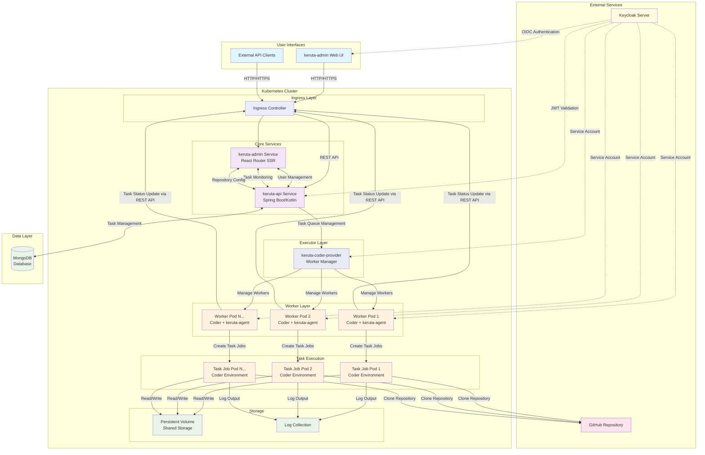

# kerutaシステム全体構成図

このドキュメントは、kerutaシステム全体の構成をMermaidダイアグラムで視覚化したものです。

## システム全体アーキテクチャ

## コンポーネント詳細

### 外部サービス
- **GitHub Repository**: ソースコード管理、タスク実行対象
- **Keycloak Server**: 認証・認可サーバー（OIDC/OAuth2）

### ユーザーインターフェース
- **keruta-admin Web UI**: Web管理パネル（React Router SSR）
- **External API Clients**: 外部システム連携

### Kubernetesクラスター
- **Ingress Controller**: 外部トラフィック制御
- **keruta-api Service**: メインAPIサーバー（Spring Boot/Kotlin）
- **keruta-admin Service**: Web UIホスティング（React Router SSR）
- **keruta-coder-provider**: Worker Pod管理・オーケストレーション
- **Worker Pods**: Coder + keruta-agentによるタスクキュー処理
- **Task Job Pods**: Coder環境での実際のタスク実行

### データ層
- **MongoDB**: メインデータストア（タスク、ユーザー、ドキュメント）
- **Persistent Volume**: 共有ストレージ
- **Log Collection**: ログ集約システム

## データフロー

### 認証フロー
1. ユーザーがKeycloakで認証
2. JWTトークンを取得
3. APIリクエスト時にトークン検証
4. オフラインモード対応

### タスク実行フロー
1. ユーザーがWeb UIでタスク作成
2. APIがタスクをMongoDBに保存
3. keruta-coder-providerがタスクキューを監視・管理
4. keruta-coder-providerがWorker Podにタスクを割り当て
5. Worker Pod（Coder + keruta-agent）がタスク処理
6. Coder環境でJob Podを作成してタスク実行
7. keruta-agentが実行結果を収集
8. 結果をAPIサーバー経由でMongoDBに保存

### Git連携フロー
1. Job Pod作成時にGitリポジトリをclone
2. タスク実行環境セットアップ
3. 共有ストレージに結果保存
4. ログ収集・監視

## 特徴

- **マイクロサービス設計**: 各コンポーネントが独立
- **Kubernetes Native**: コンテナオーケストレーション活用
- **統一認証**: Keycloak SSO対応
- **スケーラブル**: Worker Pod水平スケーリング対応
- **Git統合**: リポジトリ直接連携
- **ログ・監視**: 運用観点の考慮